# PayUForward

A **Finance Manager / Expense Tracker** mobile app built with **Expo** and **React Native**. It offers a clean, fintech-style UI with gradient balance cards, category-based tracking, monthly summaries, and local-only data storage (no backend).


## Features

- **Transactions** — Add **income** and **expense** entries with amount, category, date, and optional note; form validation for amount and category.
- **Categories** — Predefined categories plus **custom categories** with icons and colors for quick visual scanning.
- **Monthly summary** — **Total income**, **total expenses**, **remaining balance**, and a spending breakdown with an animated-style pie chart.
- **UI / UX** — Gradient balance card, bottom tab navigation (Home, Transactions, Summary, Settings), dark / light mode, keyboard-friendly add-transaction flow, haptic feedback on save, and structured empty states.
- **Data** — Persisted locally with **AsyncStorage** (no server required).

## Tech stack

- [Expo](https://expo.dev/) (SDK 55) · [Expo Router](https://docs.expo.dev/router/introduction/)
- React Native · TypeScript · [NativeWind](https://www.nativewind.dev/) (Tailwind)
- [`@react-native-async-storage/async-storage`](https://github.com/react-native-async-storage/async-storage) for persistence
- [`date-fns`](https://date-fns.org/) for dates · [`react-native-svg`](https://github.com/software-mansion/react-native-svg) for charts

## Prerequisites

- **Node.js** (LTS recommended)
- **Bun**, **npm**, or **yarn** for installs
- For running on devices/simulators:
  - **iOS**: Xcode (macOS) or a physical iPhone with Expo Go
  - **Android**: Android Studio / emulator or a physical device with Expo Go

## Setup

1. **Clone the repository**

   ```bash
   git clone https://github.com/akshat-code21/PayUForward
   cd PayUForward
   ```

2. **Install dependencies**

   ```bash
   bun install
   ```

   Or: `npm install` / `yarn install`

3. **Start the dev server**

   ```bash
   bun run dev
   ```

   Or: `npx expo start -c`

4. **Run on a platform**

   - Press `i` for iOS simulator, `a` for Android emulator, or scan the QR code with **Expo Go** on a physical device.

## Scripts

| Command        | Description                    |
|----------------|--------------------------------|
| `bun run dev`  | Start Expo with cache cleared  |
| `bun run android` | Start and open Android      |
| `bun run ios`  | Start and open iOS             |
| `bun run web`  | Start web bundler              |

## Project structure (high level)

- `app/` — Routes and screens (Expo Router: `(auth)`, `(tabs)`).
- `components/` — UI (dashboard, transactions, summary, settings, shared widgets).
- `context/` — `FinanceContext`, `SessionContext` (local session + preferences).
- `lib/` — Colors, theme, formatters, finance logic, storage helpers.
- `assets/` — Images and **Screenshots** for documentation.

---

## Screenshots

### Android

<p align="center">
  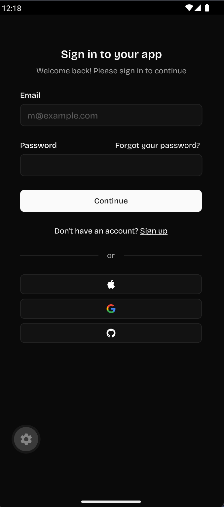
  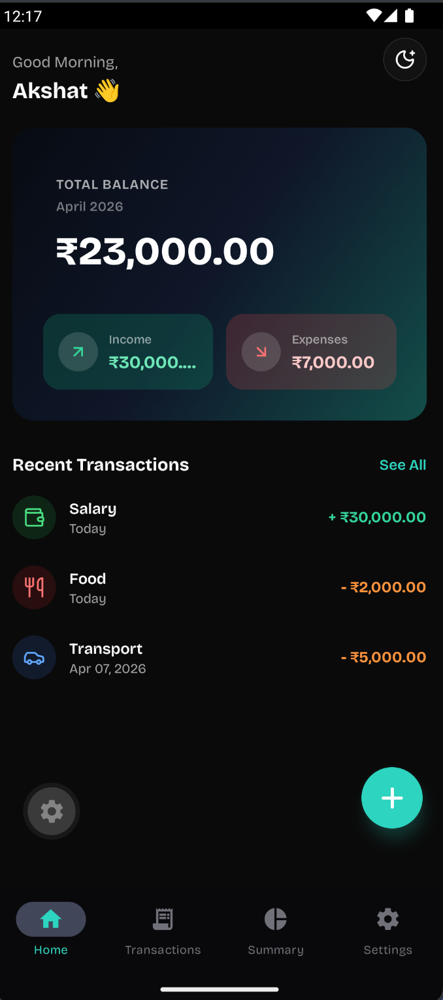
  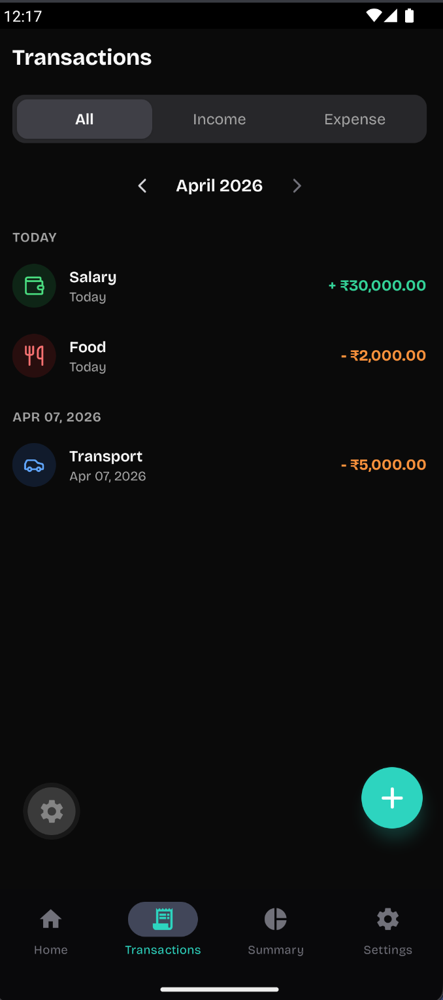
</p>

<p align="center">
  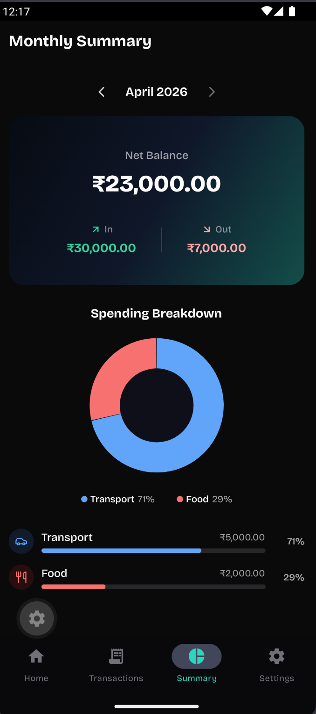
  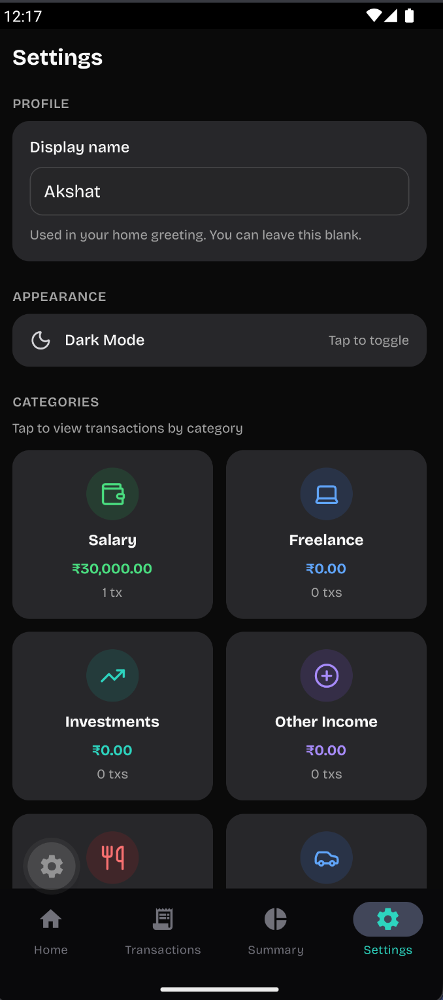
  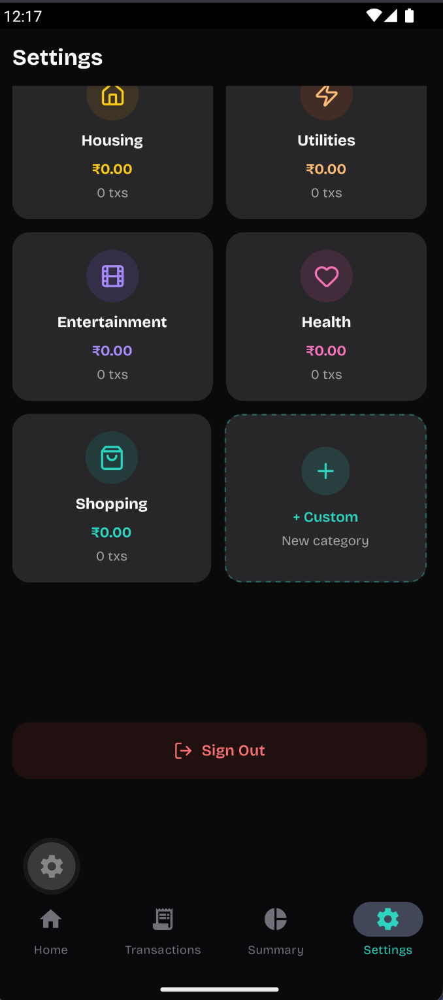
</p>

### iPhone

<p align="center">
  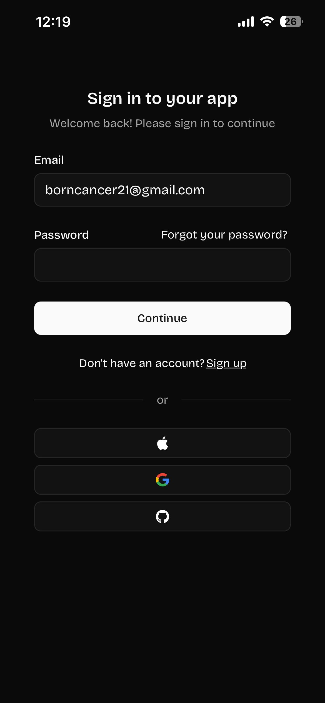
  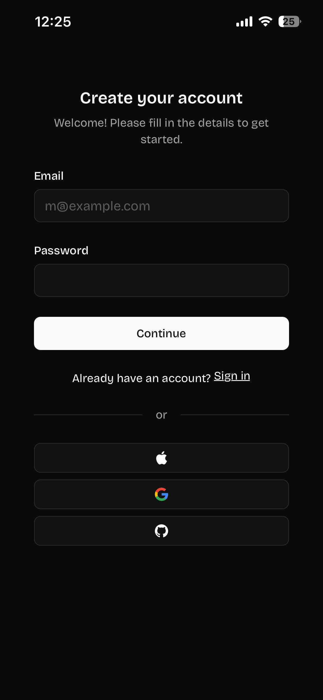
  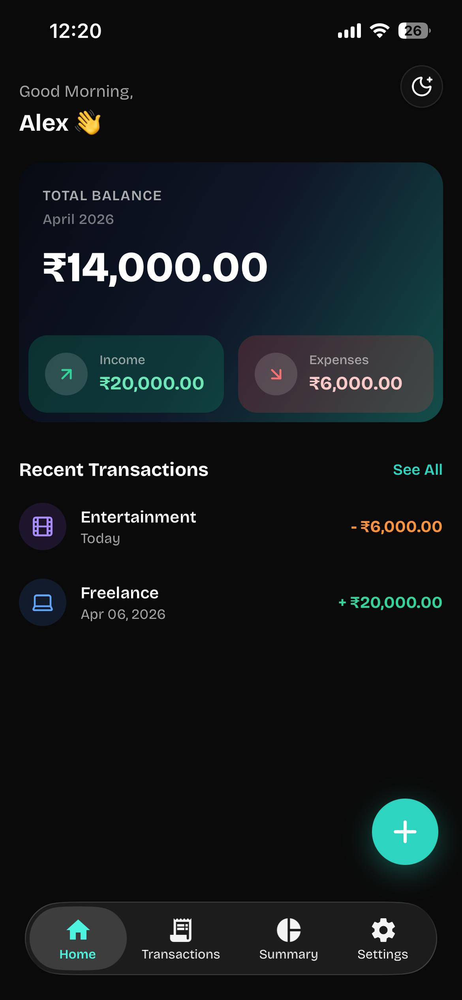
</p>

<p align="center">
  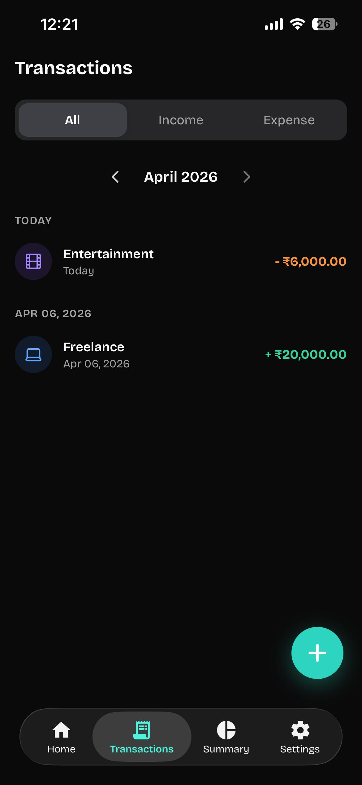
  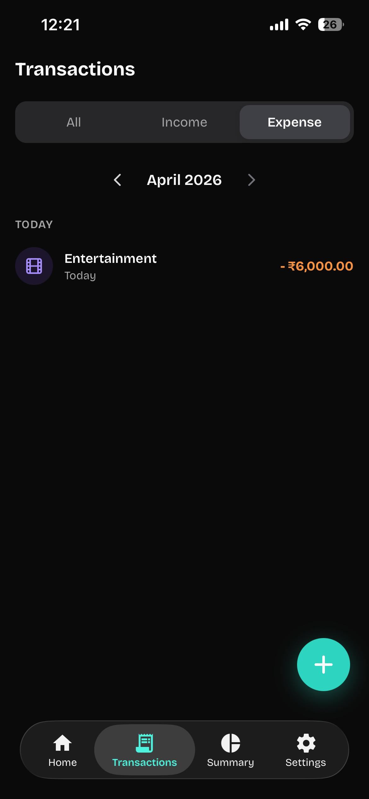
  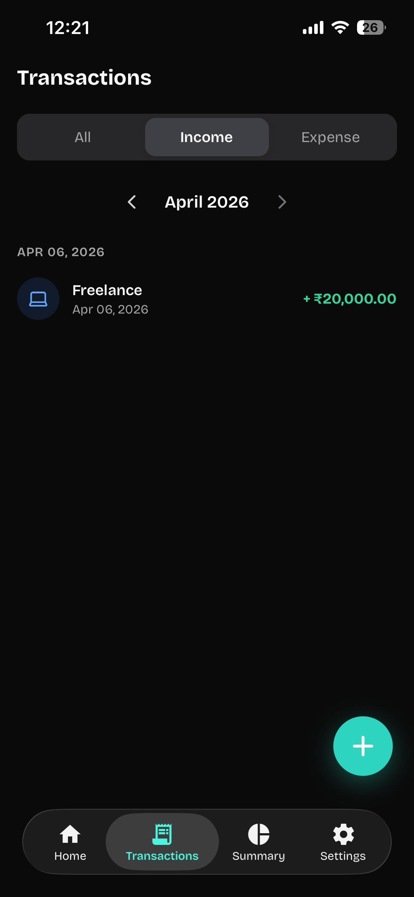
</p>

<p align="center">
  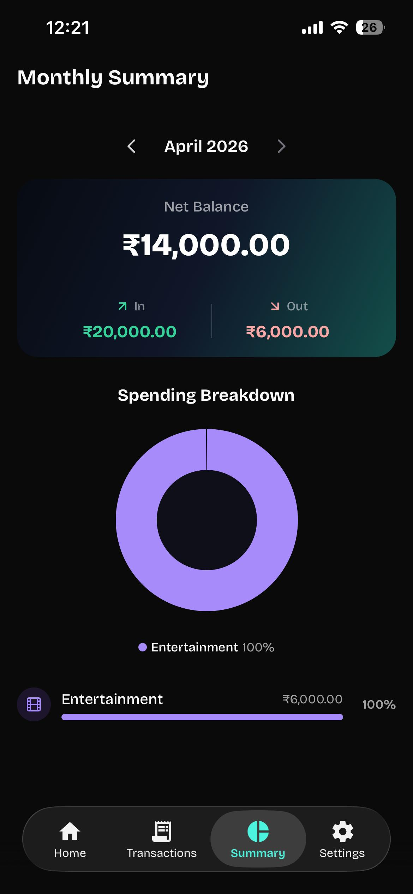
  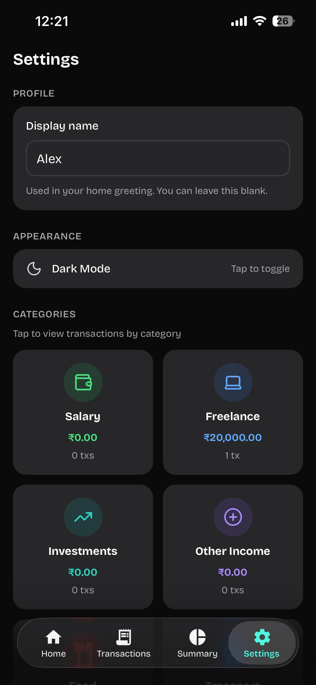
  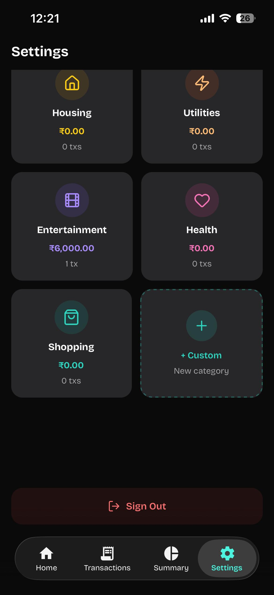
</p>

### iPhone — Light mode

<p align="center">
  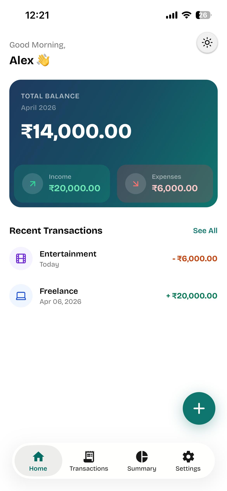
  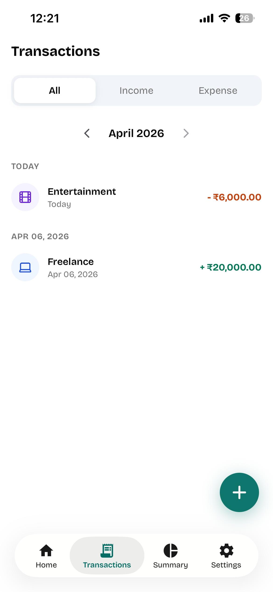
  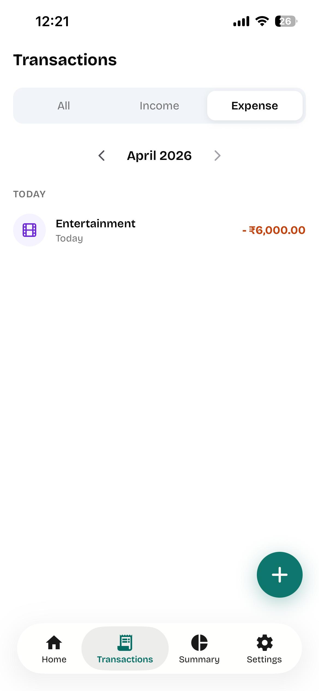
</p>

<p align="center">
  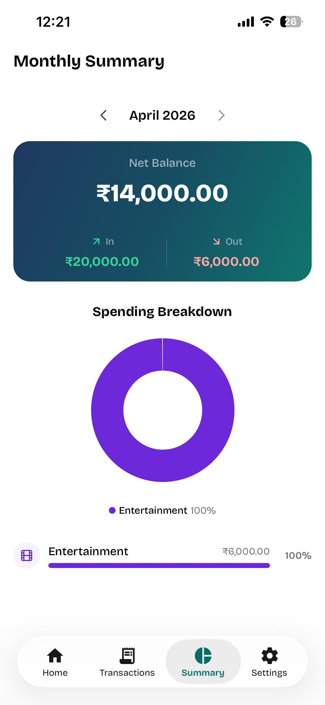
  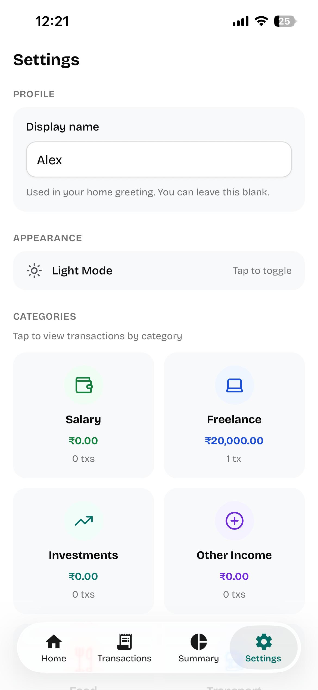
</p>

---

## Assignment alignment

| Requirement | Notes |
|-------------|--------|
| Gradient-based UI | Balance / summary gradient cards |
| Dark / Light mode | Theme toggle + Settings / Home |
| Bottom tabs (≥ 3) | Home, Transactions, Summary, Settings |
| Animations / transitions | Reanimated panels, screen flows |
| Keyboard handling | `KeyboardAvoidingView` on add-transaction form |
| Local storage | AsyncStorage via app context |
| README + setup | This document |

**Bonus (optional):** spending chart (pie / donut), swipe-style category panel, structured empty states.

